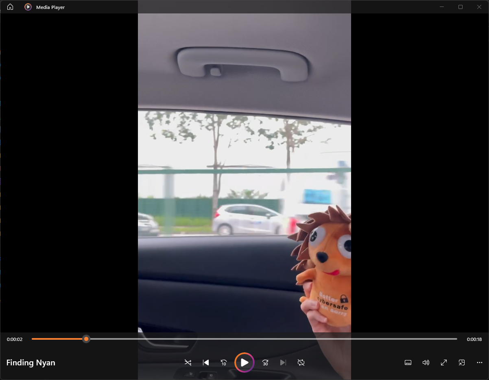

# Finding Nyan

> Points: 325 [1000]

## Description

> Jaga is on a road trip to find Nyan. Do you know which road this is in the metaverse?  
> Note that for this challenge, the road name should be CAPITAL LETTERS. For example - **STF22{JLN_BINCHANG_RD}. The road name can be seen on Google Maps.**

## Solution
Opening the video attached, we see a person sitting at a back of a car.

As we were familiar with the road and the training car used at the opposite lane, we decided to use Google Maps to find the road name. We found the road name to be Bukit Batok Rd. We then submitted the flag as `STF22{BUKIT_BATOK_RD}`.

## Flag
`STF22{BUKIT_BATOK_RD}`