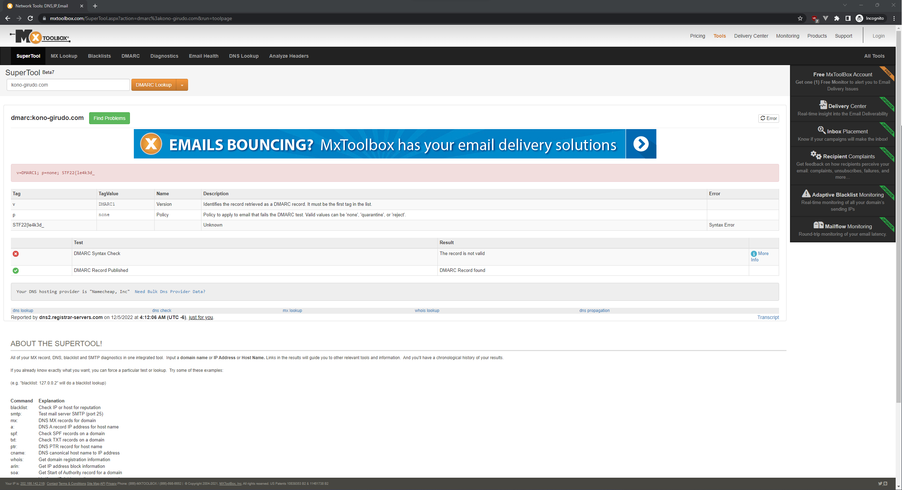
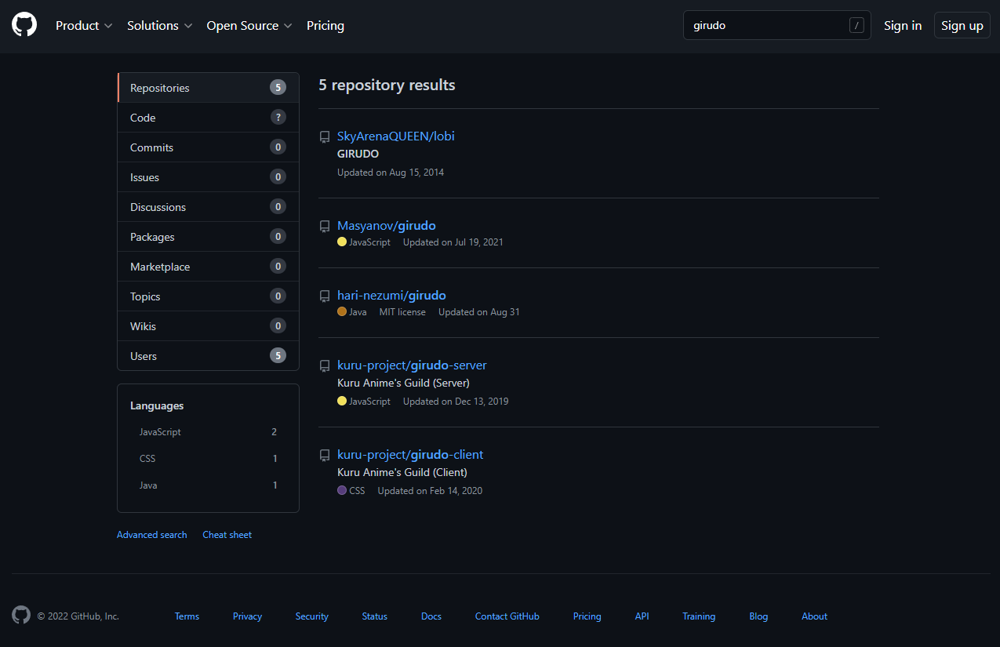
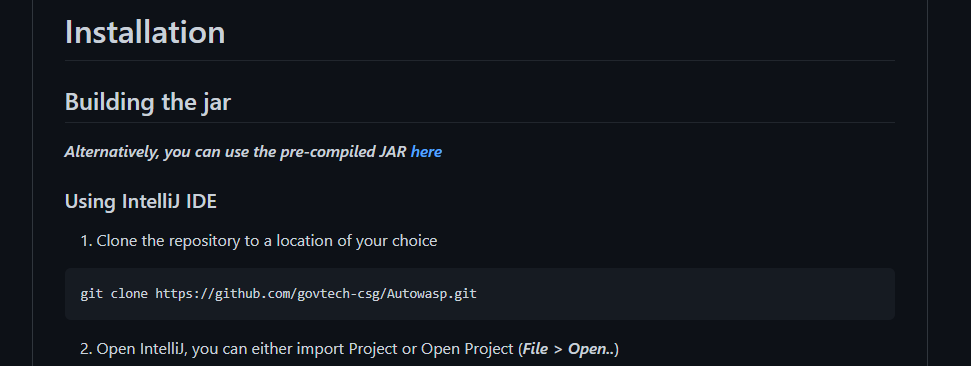
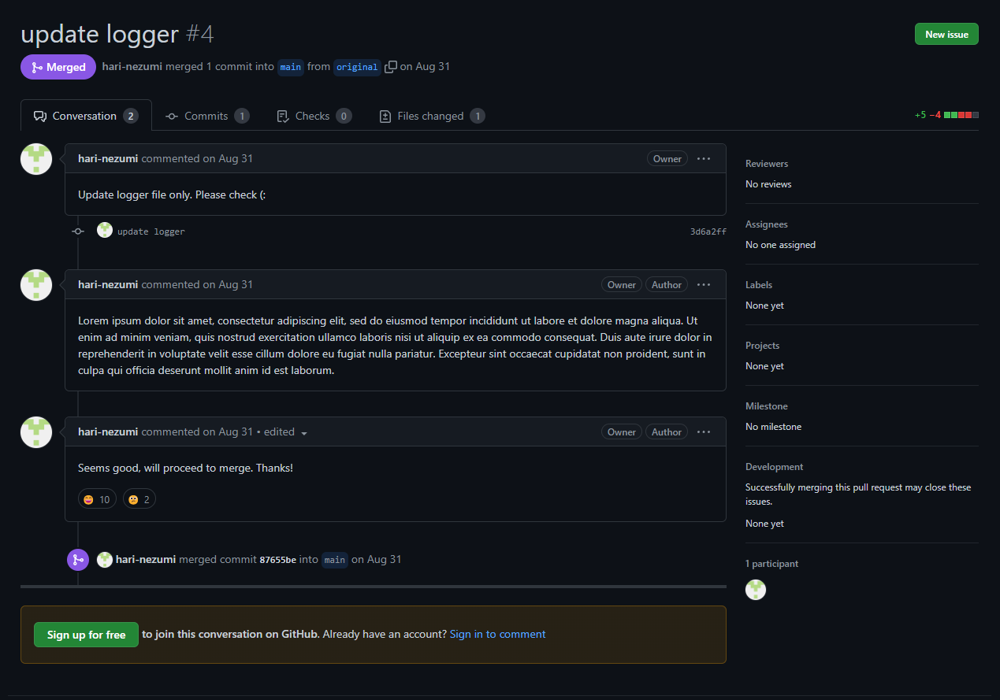
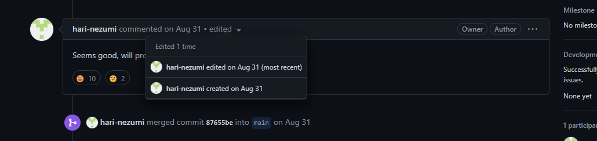
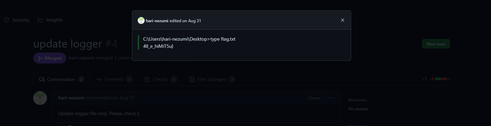

# Finding Nyan

> Points: 425 [1000]

## Description

> Jaga got summoned to the new world and was given some new tasks to investigate why the employees of kono-girudo.com kept receiving phishing emails. It also seems like there is information disclosure for those working on Girudo project but could not find out where the disclosure was.  
> Jaga needs your help to determine why they kept receiving phishing emails and what sensitive information was exposed for the project.

## Solution
As the description provided a domain name to work with, we used online tools to dig out any information from their DNS records.

One of the websites we used gave us the first part of the flag, which was hidden as part of the TXT record of the domain for DMARC.

URL for the website used: https://mxtoolbox.com/SuperTool.aspx?action=dmarc%3akono-girudo.com&run=toolpage

For the second part of the flag, we searched on GitHub for any projects named Girudo, which yielded us with a few results

We opened the most recent repository to find that the README contains information relating to the creators of the CTF, GovTech. As such, we know that we are on the right track for the second part of the flag.

After which, we used the search feature on GitHub to search for any signs of a flag, but it turned out to be a dead end. We then decided to search the issues and pull requests created by the repository owner, which yielded us with a pull request that was merged into the master branch.

Within the pull requests were a few edits to the existing comments, which contained the second part of the flag.

## Flag
`STF22{le4k3d_4ll_e_hiMiT5u}`